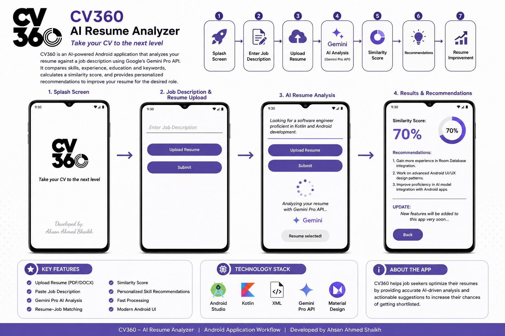

<div align="center">


# CV360 – AI Resume Analyzer

### 🚀 Take Your CV to the Next Level

An AI-powered Android application that intelligently compares resumes with job descriptions using **Google Gemini Pro API**, calculates a similarity score, and provides personalized recommendations to improve employability.


</div>

---

# 📖 Overview

CV360 is an AI-powered Android application developed using **Kotlin**, **XML**, and **Google Gemini Pro API**. The application evaluates how well a candidate's resume matches a given job description by analyzing skills, technologies, experience, education, and relevant keywords.

After processing, the application generates a **Similarity Score** and provides intelligent recommendations to help users improve their resumes before applying for jobs.

---

# ✨ Key Features

- 📄 Upload Resume (PDF/DOCX)
- 💼 Paste Job Description
- 🤖 AI Resume Analysis using Gemini Pro
- 📊 Resume Matching Score
- 🎯 Skill Gap Identification
- 💡 Personalized Recommendations
- ⚡ Fast AI Processing
- 📱 Modern Android User Interface

---

# 📊 Application Workflow

<div align="center">



</div>

The application follows an AI-driven workflow where users upload their resumes and provide a target job description. CV360 sends both inputs to Google's Gemini Pro API, which analyzes the content, identifies matching skills and experience, calculates a similarity score, and generates personalized recommendations for resume improvement.

---

# 🧠 How It Works

```
Start
   │
   ▼
Splash Screen
   │
   ▼
Enter Job Description
   │
   ▼
Upload Resume
   │
   ▼
Gemini Pro API
   │
   ▼
AI Resume Analysis
   │
   ▼
Similarity Score
   │
   ▼
Recommendations
   │
   ▼
Resume Improvement
   │
   ▼
End
```

---

# 🏗️ System Architecture

```
                User
                  │
                  ▼
          Android Application
                  │
        ┌─────────┴─────────┐
        ▼                   ▼
 Job Description      Resume Upload
        │                   │
        └─────────┬─────────┘
                  ▼
          Gemini Pro API
                  │
         AI Resume Analysis
                  │
      ┌───────────┼───────────┐
      ▼           ▼           ▼
 Similarity   Skill Gap   Suggestions
    Score      Analysis
                  │
                  ▼
            Result Screen
```

---

# ⚙️ Technology Stack

| Technology | Purpose |
|------------|---------|
| Kotlin | Android Development |
| XML | User Interface |
| Android Studio | IDE |
| Google Gemini Pro API | AI Resume Analysis |
| Material Design | UI Components |

---

# 📂 Project Structure

```text
CV360
│
├── app/
├── gradle/
├── README.md
├── logo.png
├── cv360-app-flow.png
├── build.gradle.kts
├── settings.gradle.kts
└── AndroidManifest.xml
```

---

# 🚀 Installation

### Clone Repository

```bash
git clone https://github.com/Ahsanshyk/CV360.git
```

### Open in Android Studio

```
Android Studio Hedgehog or Later
```

### Add Gemini API Key

```kotlin
const val GEMINI_API_KEY = "YOUR_API_KEY"
```

### Run

```
Connect Android Device

OR

Launch Emulator

Run ▶
```

---

# 🎯 Future Enhancements

- ATS Resume Score
- AI Cover Letter Generator
- Resume Templates
- Interview Question Generator
- Resume History
- Cloud Backup
- Dark Mode
- Multi-language Support

---

# 📈 Project Highlights

- 🤖 AI-powered Resume Matching
- 📊 Similarity Score Generation
- 💡 Personalized Recommendations
- ⚡ Google Gemini Pro Integration
- 📱 Modern Android UI
- 🚀 Kotlin + XML Architecture

---

# 👨‍💻 Developer

**Ahsan Ahmed Shaikh**

Android Developer

📧 **Email:** ahsanshaikh5534@gmail.com

💼 **LinkedIn:**  
https://linkedin.com/in/ahsan-ahmed-shaikh

💻 **GitHub:**  
https://github.com/Ahsanshyk

---

<div align="center">

## ⭐ If you like this project, don't forget to Star the repository!

Made with ❤️ by **Ahsan Ahmed Shaikh**

</div>
